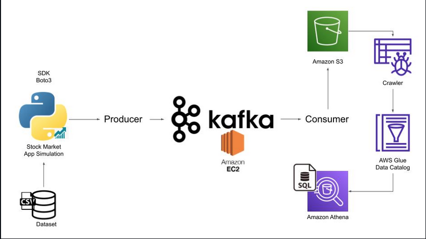

# Stock Market Kafka Real Time Data Engineering Project

## **Introduction**

In this project, you will execute an End-To-End Data Engineering Project on Real-Time Stock Market Data using Kafka.

We are going to use different technologies such as Python, Amazon Web Services (AWS), Apache Kafka, Glue, Athena, and SQL.

## **Architecture**

## **Technology used**

- Programming Language - Python
- AWS

1. S3 
2. Athena
3. Glue crawler
4. Glue Catalog
5. EC2

- Apache Kafka

## **Dataset used**

Kaggle stock market

